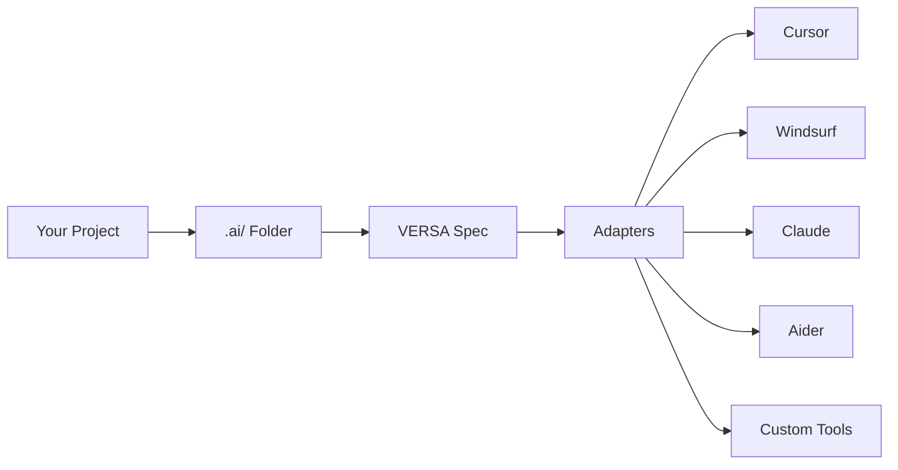

<div align="center">

# 🚀 VERSA 1.0

### Vendor-neutral Extensible Repo Spec for Agents

**One `.ai/` folder, every runtime**

[](https://dotaislash.github.io)
[](https://github.com/dotAIslash/dotaislash-spec/discussions)
[](LICENSE)
[](https://github.com/dotAIslash/dotaislash-spec/stargazers)

[**Read the Spec**](SPEC.md) · [**Examples**](https://github.com/dotAIslash/dotaislash-examples) · [**CLI Tool**](https://github.com/dotAIslash/dotaislash-cli) · [**Discussions**](https://github.com/dotAIslash/dotaislash-spec/discussions)

</div>

---

## 📖 What is VERSA?

VERSA is the **canonical specification** for portable agent configuration. It defines a standard `.ai/` folder structure that works across **Cursor, Windsurf, Claude, Aider, and any future AI coding tool**.

### The Problem

Every AI coding tool has its own config format:
- 🔴 Cursor uses `.cursorrules` and workspace settings
- 🔵 Windsurf has its own configuration
- 🟢 Claude projects have different structures
- 🟡 Aider uses `.aider.conf.yml`

**Result:** Your project context is fragmented and tool-specific.

### The Solution

```
your-project/
└── .ai/
    ├── context.json          # Base configuration
    ├── profiles/
    │   ├── cursor.json       # Cursor-specific overrides
    │   ├── windsurf.json     # Windsurf-specific overrides
    │   └── claude.json       # Claude-specific overrides
    ├── rules/
    │   ├── style.md          # Code style guidelines
    │   └── security.md       # Security policies
    ├── agents/
    │   └── code-reviewer.json
    └── tools/
        └── mcp-servers.json
```

**One folder. Every runtime. Portable forever.**

---

## ✨ Features

<table>
<tr>
<td width="50%">

### 🔄 **Portable**
Write once, run anywhere. Your `.ai/` folder works with every tool that supports VERSA.

### 🔐 **Security-First**
Explicit permission model: deny → ask → allow. Secret bindings and redaction built-in.

</td>
<td width="50%">

### 🎯 **Simple**
Plain JSON and Markdown. Human-readable. Git-friendly. Easy to diff and review.

### 🚀 **Extensible**
8 canonical primitives: Rules, Prompts, Agents, Memory, Knowledge, Tools, Settings, Permissions.

</td>
</tr>
</table>

---

## 🎯 Core Concepts

### **Eight Canonical Categories**

| Category | Purpose | Example |
|----------|---------|---------|
| 📜 **Rules** | Persistent project context | Code style, architecture patterns |
| 💬 **Prompts** | Reusable templates with variables | Bug report template, feature spec |
| 🤖 **Agents** | Declarative agent configurations | Code reviewer, documentation writer |
| 🧠 **Memory** | Retention policies and notes | Session memory, project knowledge |
| 📚 **Knowledge** | Document ingestion config | Docs, repos, URLs to index |
| 🛠️ **Tools** | MCP servers and HTTP APIs | Custom tools and capabilities |
| ⚙️ **Settings** | Model routing and preferences | GPT-4, Claude, temperature settings |
| 🛡️ **Permissions** | Security policy enforcement | File access, network calls, secrets |

---

## 🚀 Quick Start

### 1. **Initialize a `.ai/` folder**

```bash
# Using the CLI (coming soon)
npx @dotaislash/cli init

# Or manually create
mkdir .ai
cd .ai
touch context.json
mkdir profiles rules agents tools
```

### 2. **Create your base configuration**

```json
// .ai/context.json
{
  "version": "1.0",
  "rules": ["rules/style.md", "rules/security.md"],
  "context": ["src/**/*.ts", "docs/**/*.md"],
  "agents": ["agents/code-reviewer.json"],
  "settings": {
    "model": "claude-sonnet-4",
    "temperature": 0.7
  }
}
```

### 3. **Add tool-specific overrides**

```json
// .ai/profiles/cursor.json
{
  "version": "1.0",
  "merge": "deep",
  "settings": {
    "shortcuts": {
      "review": "agents/code-reviewer.json"
    }
  }
}
```

### 4. **Write your rules**

```markdown
<!-- .ai/rules/style.md -->
ai:meta
  priority: high
  attach: always
---

# Code Style

- Use TypeScript strict mode
- Prefer functional components
- Maximum line length: 100 characters
```

---

## 📚 Documentation

<table>
<tr>
<td>

### 📖 **Specification**
- [**SPEC.md**](SPEC.md) - Complete VERSA 1.0 specification
- [Merge Strategies](docs/MERGE_STRATEGIES.md)
- [Profile System](docs/PROFILES.md)

</td>
<td>

### 🧪 **Examples**
- [Minimal Example](https://github.com/dotAIslash/dotaislash-examples/tree/main/minimal)
- [Full-Featured](https://github.com/dotAIslash/dotaislash-examples/tree/main/full)
- [Monorepo](https://github.com/dotAIslash/dotaislash-examples/tree/main/monorepo)

</td>
</tr>
<tr>
<td>

### 🛠️ **Tools**
- [CLI Reference](https://github.com/dotAIslash/dotaislash-cli)
- [JSON Schemas](https://github.com/dotAIslash/dotaislash-schemas)
- [Adapters](https://github.com/dotAIslash/dotaislash-adapters)

</td>
<td>

### 🧩 **Ecosystem**
- [Conformance Tests](https://github.com/dotAIslash/dotaislash-conformance)
- [Community Adapters](https://github.com/dotAIslash/dotaislash-adapters)
- [Integration Guides](docs/INTEGRATIONS.md)

</td>
</tr>
</table>

---

## 🛠️ Ecosystem



### Official Packages

- 📋 **[dotaislash-spec](https://github.com/dotAIslash/dotaislash-spec)** - This repository (canonical spec)
- 🔧 **[dotaislash-cli](https://github.com/dotAIslash/dotaislash-cli)** - Reference CLI tool
- 📐 **[dotaislash-schemas](https://github.com/dotAIslash/dotaislash-schemas)** - JSON Schema definitions
- 📚 **[dotaislash-examples](https://github.com/dotAIslash/dotaislash-examples)** - Example configurations
- ✅ **[dotaislash-conformance](https://github.com/dotAIslash/dotaislash-conformance)** - Test suite
- 🔌 **[dotaislash-adapters](https://github.com/dotAIslash/dotaislash-adapters)** - Tool adapters

---

## 🤝 Contributing

We welcome contributions! VERSA is built openly with the community.

### Ways to Contribute

- 💬 **[Join Discussions](https://github.com/dotAIslash/dotaislash-spec/discussions)** - Ask questions, share ideas
- 🐛 **[Report Issues](https://github.com/dotAIslash/dotaislash-spec/issues)** - Found a problem? Let us know
- 📝 **[Propose Features](https://github.com/dotAIslash/dotaislash-spec/issues/new)** - Have an idea? Open an RFC
- 🔧 **[Build Adapters](https://github.com/dotAIslash/dotaislash-adapters)** - Support a new tool
- 📚 **[Improve Docs](https://github.com/dotAIslash/dotaislash-spec/tree/main/docs)** - Help others understand

### Development

```bash
# Clone the repository
git clone https://github.com/dotAIslash/dotaislash-spec.git
cd dotaislash-spec

# Read the spec
cat SPEC.md

# Check examples
cd examples/

# Run conformance tests (once available)
npm test
```

See [CONTRIBUTING.md](CONTRIBUTING.md) for detailed guidelines.

---

## 📊 Status

| Component | Status |
|-----------|--------|
| Specification | 🟡 Draft (v1.0) |
| JSON Schemas | 🟡 In Progress |
| CLI Tool | 🟡 In Progress |
| Adapters | 🔴 Planned |
| Conformance Suite | 🔴 Planned |
| Documentation | 🟡 In Progress |

**Legend:** 🟢 Stable · 🟡 In Progress · 🔴 Planned

---

## 🌟 Roadmap

### Q4 2025 - v1.0 Stable
- ✅ Core specification
- ✅ Website launch
- ⏳ JSON Schemas complete
- ⏳ Reference CLI
- ⏳ Basic adapters (Cursor, Windsurf)

### Q1 2026 - Ecosystem Growth
- 📦 npm packages published
- 🔌 Community adapters
- 📚 Comprehensive examples
- 🎓 Integration tutorials
- 🧪 Conformance certification

### Q2 2026 - Adoption
- 🤝 Tool vendor partnerships
- 📊 Usage analytics
- 🌍 Multi-language support
- 🔐 Advanced security features
- 🚀 Performance optimizations

---

## 💡 Philosophy

> **Boring is Beautiful**
> 
> VERSA uses plain JSON and Markdown. No DSLs. No magic. Just simple, portable formats that work everywhere.

> **Convention over Configuration**
> 
> Sensible defaults. Minimal required fields. Override only what you need.

> **Security by Default**
> 
> Explicit permissions. Deny-first policies. Secrets never in code.

---

## 📄 License

MIT © [dotAIslash](https://github.com/dotAIslash)

See [LICENSE](LICENSE) for details.

---

## 🔗 Links

- 🌐 **Website:** [dotaislash.github.io](https://dotaislash.github.io)
- 💬 **Discussions:** [GitHub Discussions](https://github.com/dotAIslash/dotaislash-spec/discussions)
- 🐛 **Issues:** [GitHub Issues](https://github.com/dotAIslash/dotaislash-spec/issues)
- 📧 **Email:** alphin@mycel.me

---

<div align="center">

**Built with 🔥 by the dotAIslash community**

[⭐ Star us on GitHub](https://github.com/dotAIslash/dotaislash-spec) · [🐦 Follow updates](https://github.com/dotAIslash) · [💬 Join the discussion](https://github.com/dotAIslash/dotaislash-spec/discussions)

</div>
